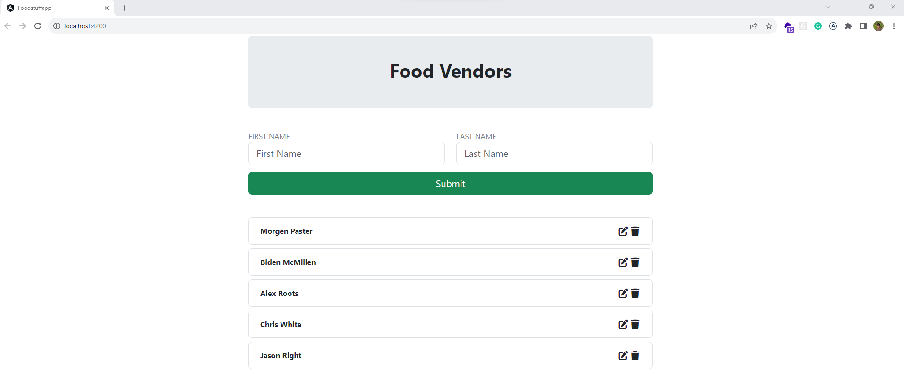
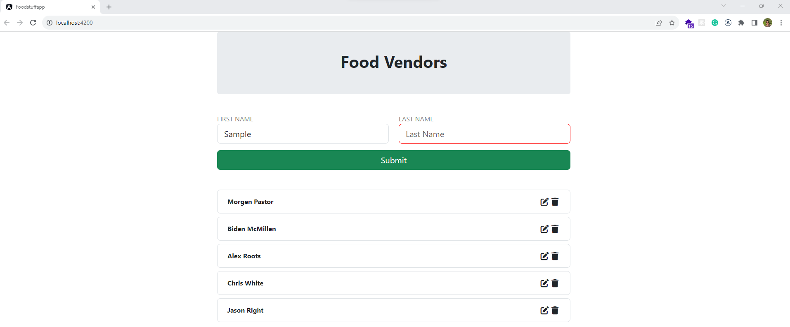
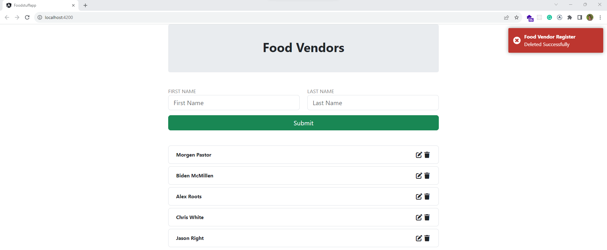
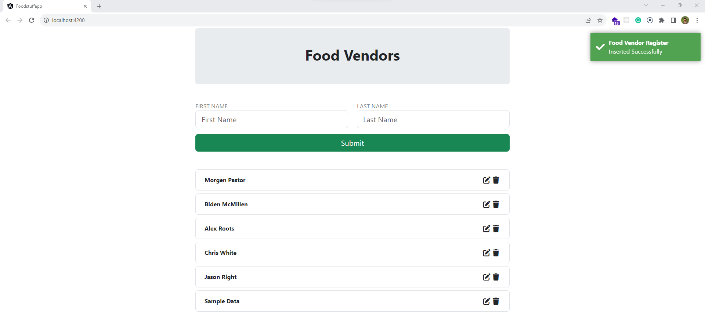
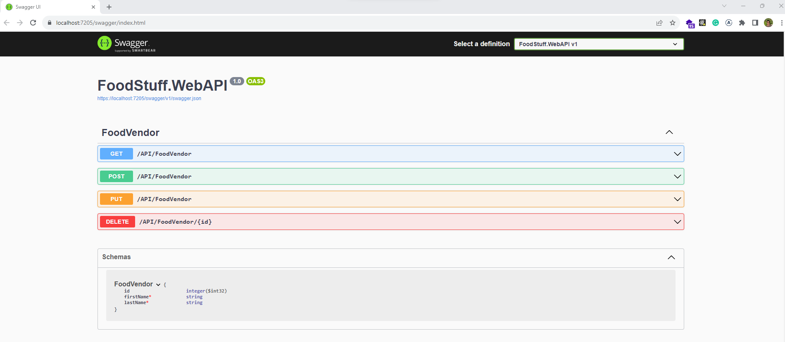

| Tech          | Version       |
| ------------- | ------------- |
| C#            |         10    |
| .NET          |           6   |
| Angular       |      16.1.0   |
| Bootstrap     |      -        |
| Fontawesome   |      -        |

#### Source

##### API - FoodStuff.WebAPI

##### Application - FoodStuff.Service

##### Domain - FoodStuff.Domain 

##### Infrastructure - FoodStuff.DAL

##### WebUI - FoodStuff.WebUI

#### Test 

##### FoodStuff.Application.IntegrationTests

##### FoodStuff.Application.UnitTests

##### FoodStuff.Domain.UnitTests

###### Default UI

###### Frontend Validation

###### Update Vendor

###### Deleted Vendor

###### Vendor Added

###### Swagger UI

